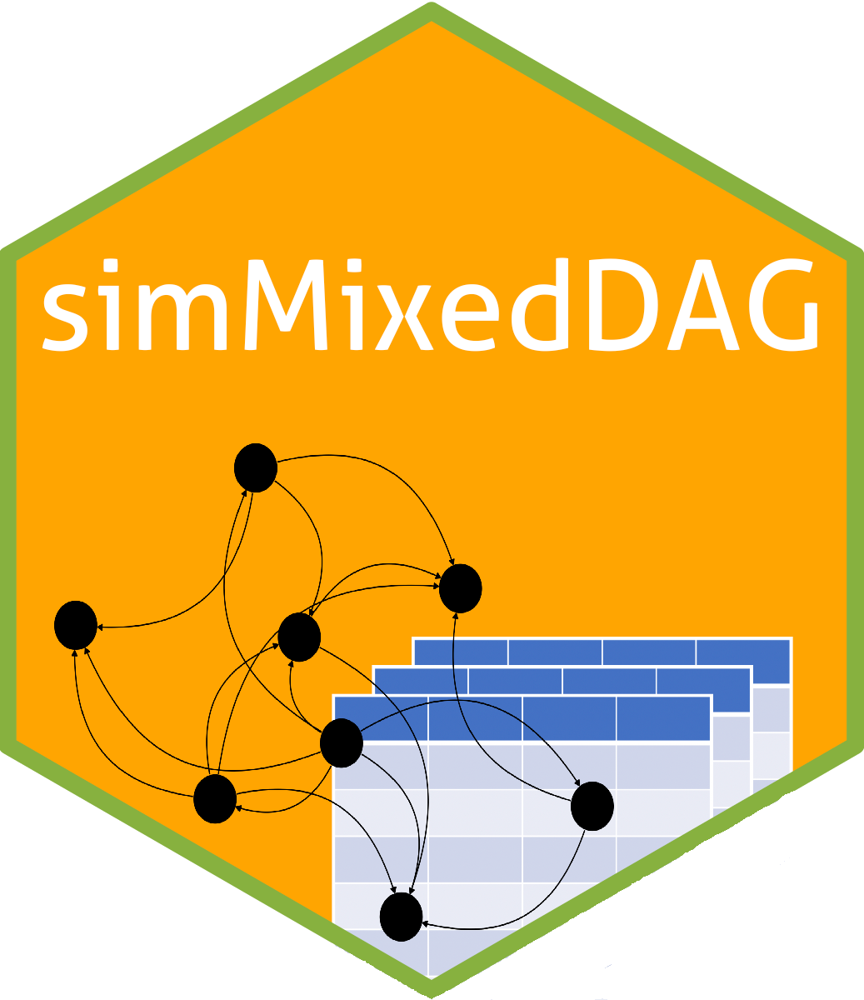

# simMixedDAG

The simMixedDAG package contains functions for simulation of both
parametric and non-parametric datasets from DAG models. It also enables calculating
average treatment effects in DAG models.

For a "vignette" of sorts see my [blog post](https://iyarlin.github.io/2019/07/23/mixed_dag_simulation_using_simmixeddag_package/).

I'm a rather poor progarammer and there's probably plenty of bugs abound.  
If you happen to run into trouble please open an issue or consider improving the code.

Kudos to Guangchuang YU for authoring the cool [hexSticker](https://github.com/GuangchuangYu/hexSticker) package, which makes creating hexagon sticker for your package (like the one on the right) a breeze.  